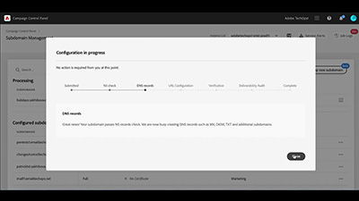
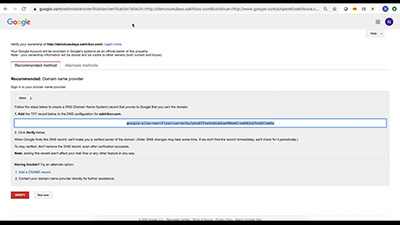
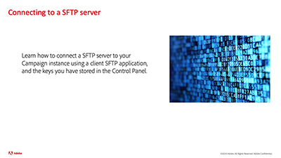

# Control Panel -  Overview

The Adobe Campaign Control Panel allows Adobe Campaign administrators to monitor key assets and perform administrative tasks, such as managing the SFTP storage by instance, managing GPG keys, or subdomains and certificates.

## What's new

* **[Control Panel for hybrid hosting models](/help/control-panel-for-hybrid-hosting-models.md)**

  *Learn how to enable Control Panel for Adobe Campaign hybrid hosting models, access Control Panel, and unlock key features.*

* **[Monitor workflows](/help/performance-monitoring/monitor-workflows.md)**
  
  *Learn how to monitor your workflows' temporary storage usage and where to configure workflow settings to avoid database or workflow issues on your instance.*

* **[Monitor throughputs and latency ](/help/performance-monitoring/monitor-throughputs-and-latency.md)**

  *Learn how to monitor delivery throughputs and transactional message latencies of your campaign instance.*

See the [Release Notes](https://experienceleague.adobe.com/docs/control-panel/using/release-notes.html) for more information on the latest product releases.

## Staff Picks

<table>
<tr>
  <td>
    
    

      <a href="./subdomains-and-certificates/subdomain-delegation.md">
    <strong>Delegating subdomains to Adobe Campaign (video)</strong>
    </a>
    

    

    <em>Learn how to fully delegate a subdomain to Adobe Campaign.</em>
    

  </td>
   <td>
    
    

    <a href="./subdomains-and-certificates/google-txt-record-management.md">
    <strong>Google TXT record management(videos)</strong>
    </a>
    

    

    <em> Learn how you can add Google TXT site verification records to all your subdomains used to send emails to GMAIL addresses with Campaign Control Panel.</em>
    

  </td>
  <td>
    
    

      <a href="./sftp-management/connect-to-sftp-server.md">
    <strong>Connecting to an SFTP Server</strong>
    </a>
    

    

    <em>Learn how to connect to your SFTP server using a client SFTP application, using the keys you have stored in the Control Panel. </em>
    

  </td>
</tr>
</table>

## Additional resources

* [Control Panel Help Center](https://experienceleague.adobe.com/docs/control-panel/using/control-panel-home.html?lang=en)
